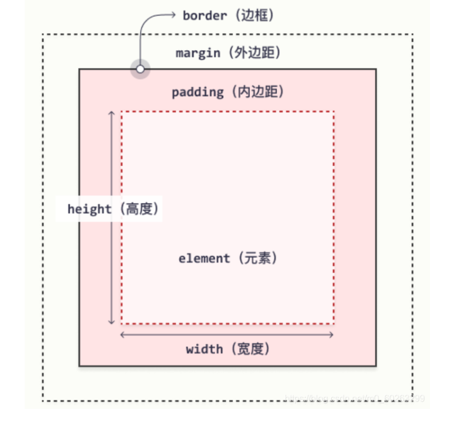

## CSS样式表

内联样式表

```html
<p style="color: red; text-align: center;">这是一个段落</p>
```

内部样式表

```css
p {
	color: red;
	background: grey;
}
```

外部样式表

```css
p {
	color: red;
	background: grey;
}
-------------  css文件内容 (css1.css)--------------
------------- html 内容   --------------
<link rel="stylesheet" href="css/css1.css">
```

### 样式表层叠优先级

| CSS样式表类型 | 优先级别 |
| ------------- | -------- |
| 内联样式表    | 最高     |
| 内部样式表    | 次高     |
| 外部样式表    | 最低     |

## CSS选择器

元素选择器  

ID选择器

类选择器

属性选择器(支持模糊查询)

[href ^= "baidu"]   表示找到a标签中href属性开头是baidu的 例如 href="baidu123456" 

[href |= "baidu"]   表示找到a标签中href属性开头是完整字符baidu的 例如 href="baidu-123456" 测试得到只有 间隔字符是 - 才能找到  无法找到baidu123456  baidu.123   baidu/123 baidu=123 baidu 123 

[href $= "baidu"]  表示找到a标签中href属性结尾是baidu的 例如 789baidu

[href *= "baidu"]	表示找到a标签中href属性包含完整字符baidu的  例如 123baidu/456

[href ~= "baidu"]	找到a标签中href属性包含单独的字符串 baidu  例如 123 baidu 456  间隔只能是空格  www.baidu.com是不行的

```css
选择元素 h1
h1 {
	text-align: center;
	font-size: 50px;
}
选择id为 left
#left {
	color: red;
	background: gray;
}
选择 class = addPoint 
.addPoint {
	color: green;
	background: black;
}
选择 超链接 且超链接的 href = http://www.baidu.com    
a[href = "http://www.baidu.com"] {
	color: green;
}
```

## 语法规则

@charset 在外部样式表使用，指定当前样式表使用的字符编码  

@important  该样式无法覆盖

## CSS取值与单位

### 数字

### 长度

### 角度

### 时间

### 文本

### 颜色

三种表示方式：RGB颜色表示法，RGB的十六进制颜色表示法，英文单词表示法

## CSS常用样式

### CSS背景 background

| 属性名称              | 解释                       | 属性值                                                    |
| --------------------- | -------------------------- | --------------------------------------------------------- |
| background-color      | 设置背景颜色               | RGB颜色表示法/十六进制表示法/直接英文表示                 |
| background-image      | 设置背景图像               | url("图片的地址")  可以是绝对地址也可以是相对地址         |
| background-repeat     | 设置背景图像是否重复平铺   | 默认x轴平铺repeat(-x/y)  / no-repeat                      |
| background-attachment | 设置背景图像是否随页面滚动 | 默认scroll随页面滚动   /  fixed固定                       |
| background-position   | 放置背景图像的位置         | 10px 100px   前面是水平方向值  后面垂直方向值  默认左上角 |

### CSS框模型



#### 内边距padding

```css
padding: 20px; 设置所有边内边距为 20px
padding: 20px 30px; 设置上下20px  左右30px
padding: 20px 10% 30% 20px; 设置上边距20px 右边距为父元素宽度的10% 下边距父元素高度的30%  左边距20px
```

单边内边距

|  padding-top   | padding-left  |
| :------------: | :-----------: |
| padding-bottom | padding-right |

#### 边框border

|   属性名称   |   解释   |                         属性值                          |
| :----------: | :------: | :-----------------------------------------------------: |
| border-width | 边框宽度 |                thin/medium/thick/像素值                 |
| border-style | 边框样式 | 默认none/实线solid/点状dotted/虚线dashed/双线double.... |
| border-color | 边框颜色 |                     三种颜色表示法                      |

```css
border: 1px solid red  简写形式
```

#### 外边距margin

```css
margin: 10px;  各外边距 10px
margin: 10px 20px; 上下10 左右20
margin: 10px 20px 10%; 上10px  右20px  下父元素宽度10%  左20px 
maigin: 10px 20px 10% 30px; 上右下左
```

#### 外边距合并/外边距叠加

如果两个元素的垂直外边距相连会发生重叠合并，其高度是合并前这**两个外边距中的较大值**

1. 当元素B在元素A下方,元素A的下边距会和元素B的上边距发生合并
2. 当元素B在元素A内部,如果元素B的上下内边距均为0，也会发生合并
3. 空元素没有边框和内边距时，上下外边距也会发生合并

只有普通块级元素的垂直外边距才会发生合并，如果是特殊情况，如浮动框，行内框，绝对定位之间的外边距是不会发生合并的.

### CSS文本

|    属性名称     |       解释       |                         属性值                         |
| :-------------: | :--------------: | :----------------------------------------------------: |
|   text-indent   |     文本缩进     |                 20px/2em(两个字的大小)                 |
|   text-align    |   文本对齐方式   |               center/left/right/justify                |
| text-decoration |     文本装饰     | 下划线underline/上划线overline/删除线line-through/none |
| text-transform  | 文本大小写的转化 |     uppercase/lowercase/capitalize首字母大写/none      |
| letter-spacing  |     字符间距     |                         长度值                         |

### CSS字体

|   属性名称   |   解释   |                        属性值                        |
| :----------: | :------: | :--------------------------------------------------: |
| font-family  | 字体系列 | 特定字体(宋体/楷体...)/通用字体(Serif/Sans-serif...) |
|  font-style  | 字体风格 |         normal/斜体字italic/倾斜字体oblique          |
| font-variant | 字体变化 |          normal/小号字的大写字母small-caps           |
| font-weight  | 字体粗细 |          normal/bold/bolder/lighter/100-900          |
|  font-size   | 字体大小 |                    px/em(16px)/%                     |

### CSS超链接

**超链接四种状态**

> 1. a:link        未被访问的超链接
> 2. a:visited   已被访问的超链接
> 3. a:hover     鼠标悬浮在上面的超链接      声明必须在a:line和a:visited之后
> 4. a:active     正在被点击的超链接              声明必须在a:hover之后

### CSS列表

| 属性名称            | 解释         | 属性值                                                 |
| ------------------- | ------------ | ------------------------------------------------------ |
| list-style-type     | 列表标志类型 | 见下表                                                 |
| list-style-image    | 列表标志图标 | url("图片地址")                                        |
| list-style-position | 列表标志位置 | 默认值文本左侧outside/文本内部inside/继承父元素inherit |
| list-style          | 简写形式     | 例如 list-style: circle outside                        |

| 属性值      | 解释                      |
| ----------- | ------------------------- |
| none        | 无标记符号                |
| disc        | 默认值，实心圆点          |
| circle      | 空心圆                    |
| square      | 空心方块                  |
| decimal     | 阿拉伯数字 1 2 3 4 5      |
| upper-roman | 大写罗马数字I II III IV V |

### CSS表格

| 属性名称        | 解释                                   | 属性值                                |
| --------------- | -------------------------------------- | ------------------------------------- |
| border-collapse | 设置表格的边框样式                     | 默认separate/合并collapse/继承inherit |
| border-spacing  | 设置表格中**双线**边框的分割距离       | 长度值/长度值1(左右) 长度值2(上下)    |
| caption-side    | 设置表格标题的位置                     | top/bottom/inherit                    |
| empty           | 定义表格中空单元格边框和背景的显示方式 | show/hide/inherit                     |
| table-layout    | 规定表格的布局方式                     | automatic/fixed/inherit               |

## CSS定位

### 绝对定位absolute

基于绝对定位的元素不占据空间  **绝对定位的基准**是已定位且包含关系最近的祖先元素 如果没有那是相对整个页面

```css
#main {  主要写法
	position:absolute;
	left: 300px;
	top: 120px;
}
```

### 相对定位relative

```css
相对定位的参照点不是左上角原点，而是该元素本身原先的起点位置， 即使该元素偏移到了很远的位置，它占据的空间仍然是起点位置
#head{
      position: relative;
      top: 20px;
}
```

### 层叠效果z-index

```css
z-index = 1    2   3  数字越大优先级越高
```

### 浮动float

| 属性值  | 解释           |
| ------- | -------------- |
| left    | 元素向左浮动   |
| right   | 元素向右浮动   |
| none    | 默认值，不浮动 |
| inherit | 继承父元素     |

```css
div {
	float: left;
	width: 300px;
	height: 250px;
}
```

