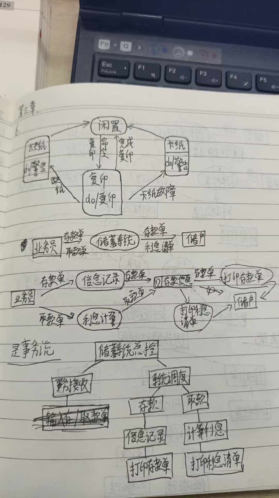
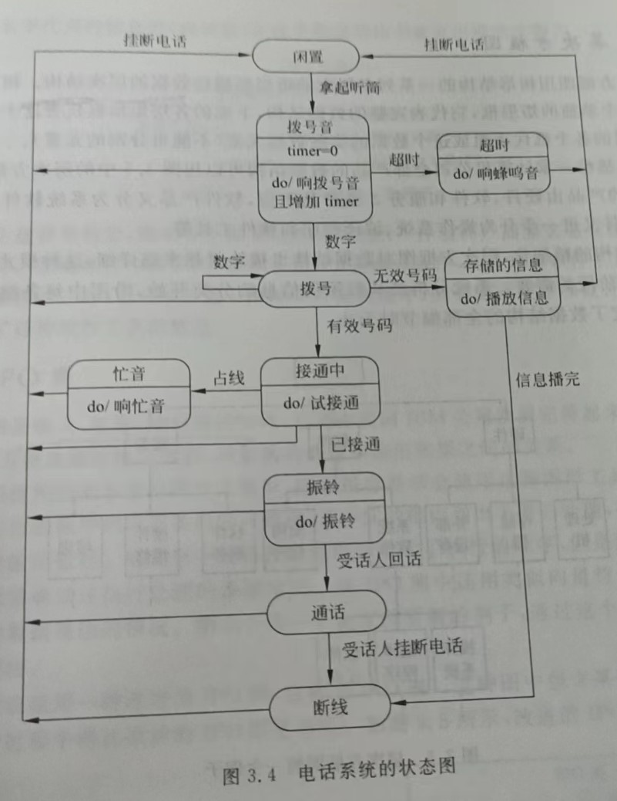
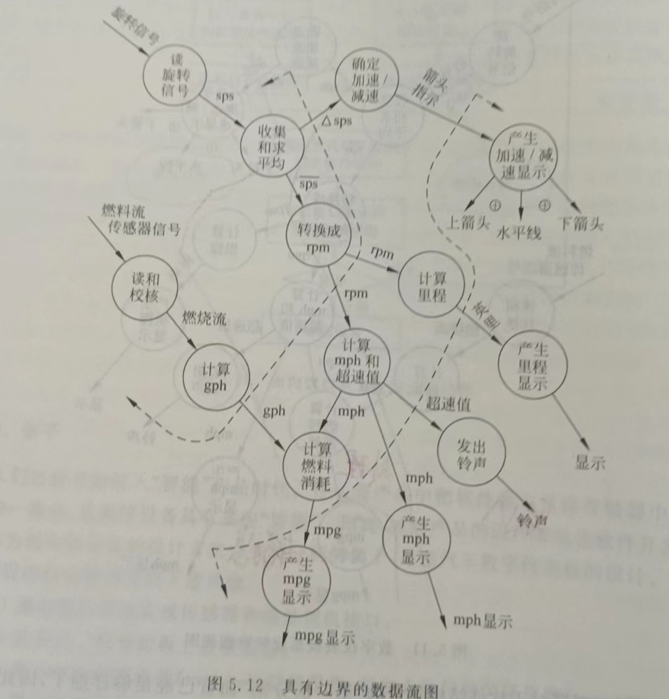
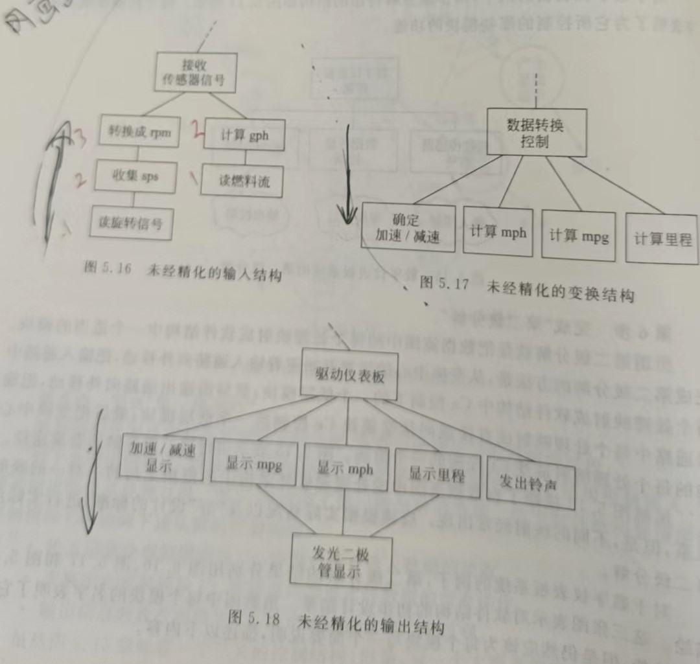
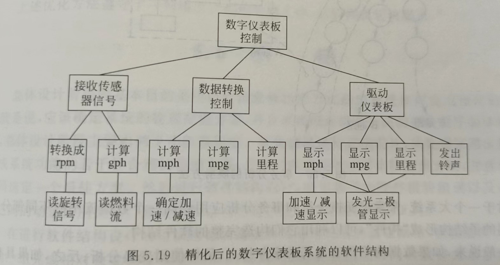
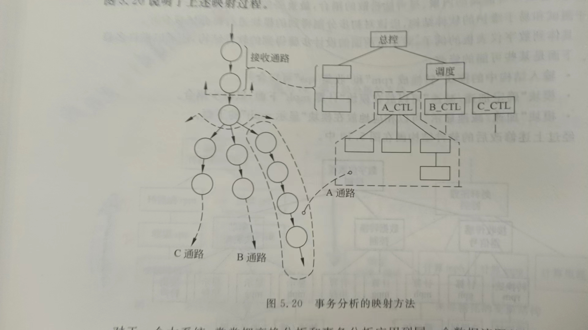
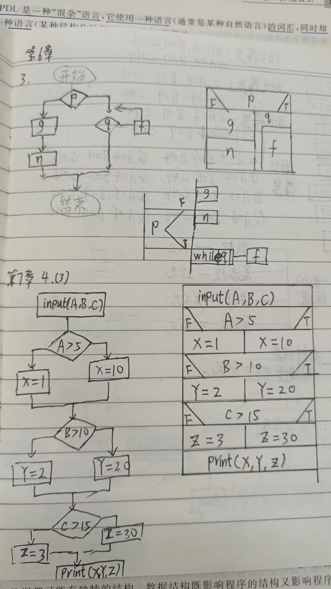
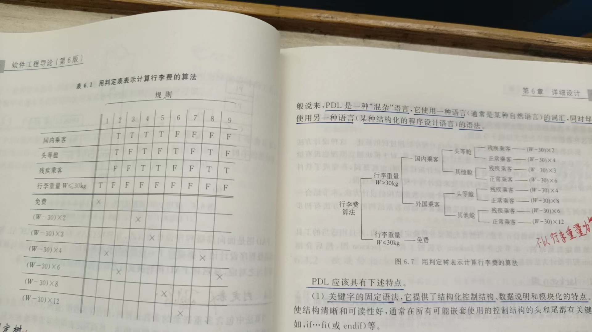

# 第一章软件工程学概述

### 软件危机

是指**计算机软件**在**开发和维护**过程中遇到的一系列严重问题

- *<u>**软件危机典型表现**</u>*：

- 1. 对软件开发成本和进度的估计常常很不准确

  2. 用户对”已完成的“软件系统不满意的现象常常发生

  3. 软件产品的质量往往不可靠

  4. 软件常常是不可维护的

  5. 软件通常没有适当的文档资料

  6. 软件成本在计算机系统总成本中所占的比例逐年上升

  7. 软件开发生产率提高的速度，远远跟不上计算机应用迅速普及深入的趋势

     

- ***产生软件危机的原因***

- - 客观原因

    1. 软件是计算机系统中的**逻辑部件**,缺乏可见性,在程序在计算机上运行之前,**软件开发过程**的进展情况**较难衡量**
    2. 软件在运行过程中不会因为使用时间过长而被"用坏",如果运行中发现错误，很可能是遇到了一个在开发时期引入的在测试时期未能检测出来的错误，因此较难维护。
    3. 软件规模庞大，程序复杂度随着程序规模的增加而呈指数上升。

  - 主观原因

    1. 忽视需求分析

    2. 重程序轻文档

    3. 轻视软件维护

       

- ***消除软件危机的途径***

  1. 对软件有一个正确的认识：软件=程序+文档+数据

  2. 认识到软件开发是一种组织良好，管理严密，协同配合的工程项目

  3. 应该推广使用在实践中总结出来的软件开发的成功的技术和方法

  4. 应该开发和使用更好的软件工具

     

### 软件工程

是指导计算机软件开发和维护的一门工程学科。采用工程的概念，技术，原理和方法来开发与维护软件，把经过时间考验而证明**正确的管理技术**和当前能够得到的**最好的技术方法**结合起来，以**经济地开发出高质量的软件**并有效的维护它，这就是软件工程

- ***软件工程的本质特征*** 

  1.  关注于大型程序的构造

  2. 中心课题的控制复杂度

  3. 软件经常变化

  4. 开发软件的效率非常重要

  5. 和谐地合作是开发软件的关键

  6. 软件必须有效地支持它的用户

  7. 在软件工程领域通常是具有一种文化背景的人替具有另一种文化背景的人创造产品

- ***软件工程的基本原理*** 

  1.  用分阶段的生命周期计划严格管理
  2. 坚持进行阶段评审
  3. 实行严格的产品控制
  4. 采用现代程序设计技术
  5. 结果应能清楚地审查
  6. 开发人员少而精
  7. 承认不断改进软件工程实践的必要性
  
  

- ***软件工程包括哪两方面***

  - 管理：通过计划，组织和控制等一系列活动，合理地配置和使用各种资源，以达到既定目标的过程
  -  技术：通常把在软件生命周期全过程中使用的一整套技术方法的集合    称作**方法学**，或**范型**

- 软件工程方法学三要素：方法，工具，过程

- ***结构化范型和面向对象范型的要点，他们的优缺点？***
  
  -  结构化范型(传统方法学)：
    - 要点：
      - 把软件生命周期的全过程分为若干个阶段，然后顺序地完成每个阶段的任务。
      - 这种模型要求每一阶段都以前一阶段形成的文档为基础完成工作。
      - 每一阶段将要完成时，都必须进行严格的技术审查和管理复审
    - 优缺点：
      - 把软件生命周期划分若个阶段，每个阶段的任务相对独立，而且比较简单，便于不同人员分工协作，降低了软件开发的难度。软件开发的成功率，生产率大大提高
      - 当软件规模庞大时，或者软件需求模糊时，开发的软件往往不成功，维护困难；这种技术要么面向行为，要么面向数据。把数据和操作分离成独立的两个部分，软件开发与维护难度增加
    
  - 面向对象方法学：
  
    - 要点:
  
      -  把对象作为融合了数据以及在数据上的操作行为的统一的软件构件
  
      -  把所有的对象都划分为类(class)
  
      -  按照父类与子类的关系，把若干个相关类组成一个层次的系统
  
      -  对象之间仅能通过发送消息互相联系
  
    - 优缺点:
      - 降低了软件产品的复杂性；提高了软件的可理解性，简化了软件的开发和维护工作。促进了软件重用

​	

### 软件生命周期

由软件定义，软件开发和软件维护三个时期组成，每个时期又分为若干阶段

- ***软件生命周期的每个阶段***
  - 软件定义阶段
    -  1问题定义，2可行性研究，3需求分析-->写出**规格说明书**，
  - 软件开发阶段
    -  4总体设计，5详细设计，6编码和单元测试，7综合测试，
  - 运行维护阶段
    -  8软件维护

### 软件过程

- ***软件过程是什么，它与软件工程方法学的关系***
  - 为了获得高质量软件所需要完成的一系列任务的框架，他规定了完成各项任务的工作步骤。是软件工程方法学***三要素***之一

- ***什么是软件生命周期模型***
  - 规定了把生命周期划分成哪些阶段以及各个阶段的执行顺序。

- ***过程模型有哪些？优缺点？***
  - 瀑布模型
    - 适用于中小型软件开发(需求明确的)
    - 优点：可强迫开发人员采用规范的方法；严格地规定了每个阶段必须提交的文档
    - 缺点：过于理想化，人在工作中不可能不犯错误；瀑布模型由文档驱动；用户只能通过文档来了解产品，难于获得用户的真实需求
  - 快速原型模型
    - 需求不明的小型项目
    - 优点：产品的开发基本上是线性顺序进行；可以获取用户的真实需求
  - 增量模型
    - 分块的大型项目
    - 第一个增量构件往往实现软件的基本需求，提供最核心的功能。
    - 优点：能**较短时间内向用户提交**可完成部分工作的产品；逐步增加产品功能可以使用户有**更充裕的时间学习和适应软件**，从而减少一个全新的软件可能给客户组织带来的冲击；规避技术风险
    - 缺点：把每个新的增量构件集成到现有软件体系结构中时，必须不破坏原来的产品；它一方面要求开发人员把软件看做一个整体，另一方面又要求开发人员把软件看作构件序列，每个构件本质上都独立于另一个构件，需要开发人员的**技术能力**能够协调这一明显矛盾。
  - 螺旋模型
    - 分块的大型项目
    - 优点：对可选方案和约束条件的强调有利于已有软件的重用，也有助于把软件质量作为软件开发的一个重要目标；减少了过多测试或资金不足的风险；维护只是模型的另一个周期，在维护和开发直接并没有本质区别
    - 缺点：风险驱动的，除非软件开发人员具有丰富的风险评估经验和这方面的专业知识，否则项目可能走向灾难。

# 第二章可行性研究

### 可行性研究的任务

- **可行性研究的目的**：**用最小的代价在尽可能短的时间内确定问题是否能够解决**

  

- **可行性研究的实质**：进行一次大大压缩简化了的系统结构分析和设计的过程，在较高的层次上以较抽象的方式进行的系统**分析**和设计过程

  - ***分析过程：***

    - 需要进一步分析和澄清问题定义
    - 导出系统的逻辑模型
    - 从系统的逻辑模型出发，探索出若干种可供选择的主要解法
    - 对每种解法都应该仔细的研究它的可行性
    - 项目实施计划

    

- ***三方面研究***

  - 技术可行性：现有的技术能实现这个系统吗

  - 经济可行性：这个系统的经济效益能超过它的开发成本吗

  - 操作可行性：系统的操作方式在这个用户组织内行得通吗

    

### 可行性研究的过程

- 复查系统规模和目标

- 研究目前正在使用的系统

- 导出新系统的高层逻辑模型 ---- 数据流图 数据字典

- 进一步定义问题

- 导出和评价供选择的解法

- 推荐行动方针

- 草拟开发计划

- 书写文档提交审查

  

### 系统流程图

概况地描述物理系统的传统工具

### 数据流图(重点)

一种图形化技术，描绘信息流和数据从输入移动到输出的过程中所经受的变换

基本目的：1利用它作为交流信息的工具，2作为分析和设计的工具，3当用数据流图辅助物理系统的设计时，以图中不同处理的定时要求为只能，能够在数据流图上画出许多组自动化边界，每组自动化边界意味着一个不同的物理系统

- ***四个成分***
  - 方框 代表数据的**源点/终点**
  - 圆圈 代表数据的处理
  - 双杠一边开口一边闭合 数据存储
  - 箭头 数据流

### 数据字典

是关于数据的信息的集合，也就是对数据流图中包含的所有元素的定义的集合

- 与数据流图的关系
  - 数据流图和数据字典共同构成系统的逻辑模型
  - 没有数据字典，数据流图就不严格，没有数据流图，数据字典也难以发挥。
  - 只有数据流图和对数据流图中每个元素的精确定义放在一起，才能共同构成系统的规格说明
- 四类元素
  1. 数据流
  2. **数据流分量**（数据元素）
  3. 数据存储
  4. 处理

# 第三章需求分析

- 准确地回答“**系统必须做什么**”这个问题

- ***与可行性研究的区别***

  - 虽然在可行性研究阶段已经粗略地了解了用户需求，甚至还提出了一些可行的方案，但是可行性研究的基本目的是较小的成本在较短的时间内确定是否存在可行的解法，因此忽略了许多细节。所以可行性研究不能替代需求分析

  

### 需求分析的任务

- 确定对系统的综合要求
- 分析系统的数据要求
- 导出系统的**逻辑模型** --- 数据流图  实体-联系图 数据字典 ....
- 修正系统开发计划

### 分析建模与规格说明

- ***三种模型***
  - 实体-联系图(E-R图)：描绘**数据对象及数据对象**之间的关系 ----数据模型
  - 数据流图：描绘**数据**在软件系统中移动所经历的变换----功能模型
  - 状态转换图：描绘了系统的各种**行为模式**(状态)和在不同状态间**转换的方式**---行为模型

### 实体-联系图

1. 数据对象
2. 数据对象的属性
3. 数据对象之间的联系

### 状态转换图(重点)

没什么好些的，会画就行

### 其他图形工具

层次方框图   Warnier图  IPO图

### 验证软件需求

1. 一致性：需求必须是一致的，任何一条需求不能和其他需求相互矛盾。
2. 完整性：需求必须是完整的，规格说明书应该包括用户需要的每个功能。
3. 现实性：需求必须是可以在现有的硬件技术和软件技术基础上可以实现的。
4. 有效性：需求必须是有效的，确定能解决用户面对的问题。

# 第五章总体设计

基本目的是回答“**概括的说，系统应该如何实现**”这个问题

### 设计过程

- 两个阶段：
  - 系统设计阶段
    1. 设想供选择的方案
    2. 选取合理的方案
    3. 推荐最佳方案
  - 结构设计阶段
    1. 功能分解
    2. 设计软件结构
    3. 设计数据库
    4. 制定测试计划
    5. 书写文档
    6. 审查和复审

### 设计原理(重点)

#### 模块化

**模块**：由边界元素限定的相邻程序元素的序列，而且只有一个总体标识符代表它

**模块化**：把程序划分为独立命名且可独立访问的模块，每个模块完成一个子功能，把这些模块集成起来构成一个整体，可以完成指定的功能满足用户的需求

- ***模块化的优点：***
  - 可以使软件结构清晰，不仅容易设计也容易阅读和理解
  - 有助于软件开发工程的组织管理，一个复杂的大型程序可以由许多程序员分工编写不同的模块

#### 抽象

**抽象**：抽出事物的**本质特性**而暂时不考虑他们的细节

#### **逐步求精**

为了能集中精力解决主要问题而尽量**推迟对问题细节的考虑**

是和抽象**互补**的一对概念

#### 信息隐藏和局部化

信息隐藏：一个模块内包含的信息对于不需要这些信息的模块，**是不能访问的**

局部化：把一些**关系密切**的软件元素物理地放得**彼此靠近**

#### 模块独立

模块独立是模块化，抽象，信息隐藏和局部化概念的直接结果

- ***模块独立的好处***
  - 有效的模块化的软件比较**容易开发**出来
  - 独立的模块比较**容易测试和维护**
- ***模块独立程度的标准***
  - 耦合
    - 是对一个软件结构内**不同模块**之间**互联程度**的度量
    - 数据耦合：连个模块彼此间通过参数传递信息，且交换的信息**仅仅是数据**
    - 控制耦合：交换的信息中**还有控制信息**
    - 特征耦合：把整个数据结构作为参数传入一个模块，但是这个模块只需要其中一部分数据元素
    - 公共环境耦合：两个或多个模块通过一个公共数据环境互相作用时
    - 内容耦合：
      - 一个模块访问另一个模块的内部数据
      - 一个模块不通过正常入口而转到另一个模块的内部
      - 两个模块有一部分程序代码重叠
      - 一个模块有多个入口
  - 内聚     高内聚往往代表着模块间的松耦合
    - 一个模块内各个元素彼此结合的紧密程度
    - 偶然内聚：一个模块完成一组任务，这些任务彼此间即使有关系，关系也是很松散的
    - 逻辑内聚：一个模块完成的任务在逻辑上属于相同或相似的一类
    - 时间内聚：一个模块包含的任务必须在同一时间段内执行
    - 过程内聚：一个模块内的处理元素是相关的，而且必须以特定次序执行
    - 通信内聚：一个模块内所有元素都是用同一个输入数据和产生同一个输出数据
    - 顺序内聚：一个模块内的处理元素和同一个功能密切相关，而且这些处理必须顺序执行
    - 功能内聚：一个模块内所有处理元素属于一个整体，完成一个单一的功能

### 启发规则

1. 改进软件结构提高**模块独立性**
2. 模块**规模**应该*适中*
3. **深度，宽度，扇出，扇入**应适当、
   1. 顶层扇出比较高，中层扇出较少，底层扇入到公共的实用模块中

4. 模块的**作用域应该在控制域**之内
5. 力争**降低**模块**接口**的*复杂程度*
6. 设计**单入口单出口**的模块
7. 模块**功能**应该*可以预测*

### 描绘软件结构的图形工具

层次图和HIPO图

层次图描绘软件的层次结构，层次方框图描绘数据的层次结构

### 面向数据流的设计方式(重点)

概念：把信息流映射成软件结构

- 分类
  - 变换流：进入系统的信息流通过变换中心，经加工处理后沿输出通路离开软件系统
  - 事务流：输入的事务有**明显分流**

# 第六章详细设计

根本目标：**确定应该怎样具体地实现所要求的系统**

### 过程设计的工具(重点)

主要考点：程序流程图，N-S图，PAD图三者转换

#### 程序流程图

历史最悠久，使用最广泛的描述过程设计的方法，然而也是最混乱的

- 缺点：
  - 本质上不是逐步求精的好工具，它诱使程序员过早地考虑程序的控制流程，而不是程序的全局结构
  - 用箭头表示控制流，因此程序员不受任何约束，可以完全不顾结构程序设计的精神，随意转移控制
  - 程序流程图不易表示数据结构

#### 盒图(N-S图)

- 功能域明确，可以从盒图上一眼看出来
- 不可能任意转移控制
- 很容易确定局部和全程数据的作用于
- 很容易表现出嵌套关系

#### PAD图

- 使用PAD符号所设计出来的程序必然是结构化程序
- 描绘的程序结构十分清晰
- 设计出来的程序逻辑，易读，易懂，易记

### 面向数据结构的设计方法

#### jackson图

**考点jackson图五个步骤，画出jackson图**

1. 分析并确定输入数据和输出数据的逻辑结构
2. 找出输入数据结构和输出数据结构中有对应关系的数据单元
3. 用下述3天规则从描述数据结构的jackson图导出描绘程序结构的jackson图

   - 为每对有对应关系的数据单元，按照它们在数据结构图中的层次在程序结构图的相应层次画一个处理框
   - 根据输入数据结构中剩余的每个数据单元所处的层次，在程序结构图的相应层次分别为它们画上对应的处理框
   - 根据输出数据结构中剩余的每个数据单元所处的层次，在程序结构图的相应层次分别为它们画上对应的处理框
4. 列出所有操作和条件，并把它们分配到程序结构图的适当位置
5. 用伪码表示程序

#### 层次图方框的区别

1.  jackson图实质上是对层次方框图的一种精化，
2. 含义不同：层次方框图一个方框代表一个模块，jackson图一个方框通常只代表几个语句
3. 关系不同：层次方框图表现的是调用关系上层调用下层，而jackson图表现的是组成关系，一个方框的操作由下层组成

### 程序复杂程度的定量度量

#### McCabe方法

根据**程序控制流**的复杂程度定量度量程序的复杂程序----》 环形复杂度

环形复杂度V(G)=P+1;  P为流图中判定结点的数目  if语句的数目

#### Halstead方法

根据程序中运算符和操作数的总数来度量程序的复杂程度

# 第七章实现

### 软件测试基础

- **软件测试的目标**
  1. 测试是为了发现程序中的错误而执行程序的过程
  2. 好的测试方案是极可能发现迄今为止尚未发现错误的测试方案
  3. 成功的测试是发现了至今为止尚未发现的错误的测试
- **软件测试的准则**
  1. 所有测试都应该能追溯到用户的需求
  2. 应该远在测试开始之前就制定出测试计划
  3. 测试发现的错误中的80%很可能是由程序中20%的模块造成的
  4. 应该从“小模块”测试开始，并逐步进行”大规模“测试
  5. 穷举测试是不可能的
  6. 有独立的第三方从事测试工作
- **测试方法**
  1. 白盒测试(结构测试)：把程序看成装在一个透明的百盒子里，测试者完全知道程序的结构和处理算法
  2. 黑盒测试(功能测试)：把程序看做一个黑盒子，完全不考虑程序的内部结构和处理过程。是在程序接口进行的测试，它只检测程序的功能是否按照规格说明书的规定正常使用，程序是否能适当地接收输入数据并产生正确的输出信息；程序运行过程中能否保持外部信息的完整性
- **测试步骤**
  - 模块测试：保证每个模块作为一个单元能正确运行，所以模块测试通常又称为单元测试
  - 子系统测试：把经过单元测试的模块放在一起形成一个子系统测试
  - 系统测试：把经过测试的子系统装配成一个完整的系统来测试，**和子系统测试统称为集成测试**
  - 验收测试：把软件系统作为单一的实体进行测试，测试内容与系统测试基本类似（用户参与是重点）
  - 平行运行：同时运行新开发出来的系统和将被它取代的旧系统

### 单元测试

主要使用白盒测试技术

- **测试重点**
  - 模块接口，局部数据结构，重要的执行通路，出错处理通路，边界条件

### 集成测试

- 非渐增式测试：一下子把所有模块放在一起，并把庞大的程序作为一个整体来测试。 测试情况十分复杂。
- 渐增式测试：把程序划分成小段来构造和测试，在这个过程中比较容易定位和改正错误；对接口可以进行更彻底的测试。主要有自顶向下和自底向上两类

#### 自顶向下集成：

从主控制模块开始，沿着程序的控制层次向下移动，逐渐把各个模块结合起来

有深度优先和广度优先两类

步骤：

1. 对主控模块进行测试，测试时用存根程序代替所有直接附属于主控制模块的模块
2. 根据选定的结合策略，每次用一个实际模块代换一个存根程序
3. 在结合进一个模块的同时进行测试
4. 为了保证加入模块没有引进新的错误，可能需要进行回归测试

#### 自底向上集成：

从”原子“模块开始组装和测试

步骤：

1. 把底层模块组合成实现某个特定的软件子功能的族
2. 写一个驱动程序，协调测试数据的输入输出
3. 对由模块组成的子功能族测试
4. 去掉驱动程序，沿软件结构自下向上移动，把子功能族组合起来称为更大的子功能族

#### 上两者比较

自顶向下优点：不需要测试驱动程序，能够在测试阶段的早期实现并验证系统的主要功能，而且能在早期发现上层模块的接口错误。

自顶向下缺点：需要存根程序，可能遇到与此相联系的测试困难，底层关键模块中的错误发现较晚，而且不能充分展开人力。

自底向上优缺点与之相反

**回归测试**：重新执行已经做过测试的某个子集-

### 确定测试

也称验收测试，主要使用**黑盒**测试技术 主要**验证软件的有效性**

**软件有效性**：如果软件的功能和性能如同用户所合理期待的那样，软件就是有效的

**确认测试的范围**：必须有用户积极参与，或以用户为主进行

- 测试产生的可能结果：
  - 功能和性能与用户要求一致，软件是可以接受的
  - 功能和性能与用户要求的有差距

**软件配置复查**：保证软件配置的所有成分都齐全，质量符合要求，文档与程序完全一致，具有完成软件维护所必须的细节，且编好目录

**Alpha测试：**由用户在开发者场所进行，并且在开发者对用户的“指导”下进行

**Beat测试：**由软件的最终用户们在一个或多个客户场所进行。beta测试在alpha测试之后

### 白盒测试技术

#### 逻辑覆盖

- 语句覆盖：选择足够多的测试数据，使被测程序中每个语句至少执行一次
- 判定覆盖：不仅每个语句至少执行一次，而且**每个判定的每种可能的结果**都应该至少执行一次
- 条件覆盖：不仅每个语句至少执行一次，而且使**判定表达式中的每个条件**都应该取到各种可能的结果
- 路径覆盖：程序中每条路径都应该至少执行一次。 **最强程度的覆盖**

### 黑盒测试技术
